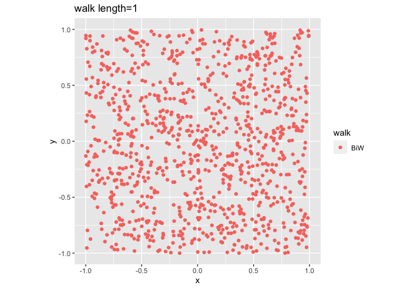

#  Visualize sampling in a polytope 
```R
#sampling in a cube
library(volesti)
library(ggplot2)
library(gridExtra)
library(plotly)

#sampling in a 3D cube
x1<-runif(1000, min = -1, max = 1)
x2<-runif(1000, min = -1, max = 1)
x3<-runif(1000, min = -1, max = 1)

#plot
layout(
  plot_ly(x=x1, y=x2, z=x3, type="scatter3d", mode="markers"),
  title = "\n\nSampling of 3D cube"
)

```


```
# sampling in a 3D sphere 
points = direct_sampling(n = 500, body = list("type" = "hypersphere", "dimension" = 3))
points_3D= as.data.frame(t(points))

make_3d_circ <- function(center = c(0,0),diameter = 2,non_dim='z'){
  radius = diameter/2
  circle_points <- seq(0,2*pi,length.out = 500)
  d1 <- center[1] + radius*cos(circle_points)
  d2 <- center[2] + radius*sin(circle_points)
  if(non_dim=='z'){
    return(data.frame(V1 = d1, V2 = d2, V3=0))
  }
  else if(non_dim=='y'){
    return(data.frame(V1 = d1, V2 = 0, V3=d2))
  }
  else{
    return(data.frame(V1 = 0, V2 = d1, V3=d2))
  }
  
}

cycle_3D = data.frame(matrix(ncol = 3, nrow = 0))

colnames(cycle_3D) <- c("V1", "V2", "V3")
all_data = rbind(sampled_data_3D,cycle_3D)
#plot
layout(
  plot_ly(x=all_data$V1, y=all_data$V2, z=all_data$V3, type="scatter3d", mode="markers", color = points_3D$color),
  title = "\n\nDirect sampling of 3D Ball"
)

```


#  Sample approximate uniformly points from a random generated polytope using the implmented in volesti random walks, for various walk lengths. For each sample compute the PSRF and report on the results.
```

library(ggplot2)
library(volesti)
library(devtools)
#devtools::install_github("dvats/mcmcse")


target.psrf <- function(p, m, epsilon = .05, delta = NULL, alpha=.05){
  if(is.null(delta)){
    Tee <- as.numeric(minESS(p, epsilon, alpha = alpha)) #min effective sample size
  }
  
  if(is.null(delta) == FALSE){
    Tee <- M <- m/((1+delta)^2 - 1)
    epsilon <- as.numeric(minESS(p, eps = epsilon, ess = M))
  }
  
  del <- sqrt(1 + m/Tee) - 1
  arr <- 1 + del  
  list(psrf = arr, epsilon = epsilon)
}


for (step in c(1,20,100,150)){
  for (walk in c("BiW")){
    P <- gen_cube(100, 'H')
    points1 <- sample_points(P,n=1000,random_walk = list("walk" = walk, "walk_length" = step))
    g<-plot(ggplot(data.frame( x=points1[1,], y=points1[2,] )) +
              geom_point( aes(x=x, y=y, color=walk)) + coord_fixed(xlim = c(-1,1),
                                                                   ylim = c(-1,1)) + ggtitle(sprintf("walk length=%s", step, walk)))

    print(target.psrf(p=3,m=step))
  }
  
}
#The `potential scale reduction factor' (PSRF) is an estimated factor by which the scale of 
# the current distribution for the target distribution might be reduced if the simulations were continued
# for an infinite number of iterations. Each PSRF declines to 1 as the number of iterations approaches infinity.

#if the PSRF is close to 1, we can conclude that each of the m sets of n simulated observations is close to the target distribution.

# output : 
```

```
'''
c = 1 
$psrf
[1] 1.000062
$epsilon
[1] 0.05
```

```
c = 20 
$psrf
[1] 1.00123
$epsilon
[1] 0.05
```

```
c= 100
$psrf
[1] 1.006137
$epsilon
[1] 0.05
```

```
c= 150
$psrf
[1] 1.009191
$epsilon
[1] 0.05
'''
```
# Implement Gibbs sampler for uniform sampling from a polytope in C++ following the code structure of volesti.
